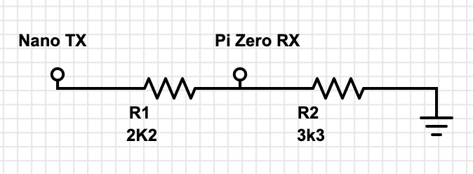
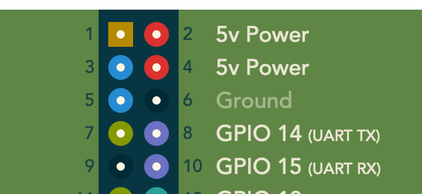
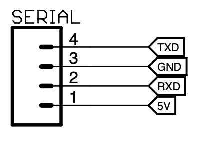
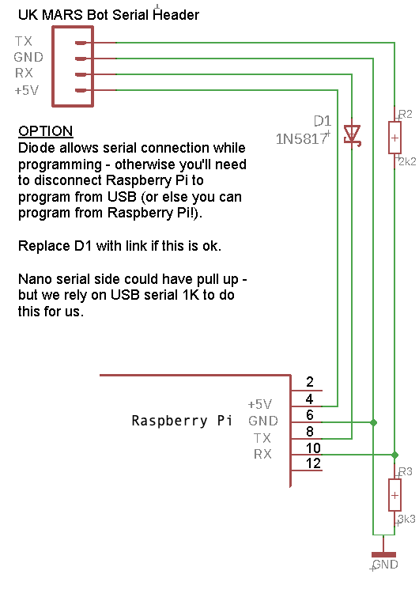

# Summary of Electrical Connections between Pi Zero and Arduino Nano

The basic connections are: 

 1. Ground - ideally several ground points will prevent problems with power and data
 2. 5v
 3. TX - data transmit
 4. RX - data receive

NOTE: This leaves many pins free for other uses on the Raspberry Pi Zero!

Connection header - The UK MARS Bot provides a 4 pin header with the above connections. Although it only contains a single ground, it’s probably good enough to experiment with as long as the header is tight.

Nano TX / Pi Zero - voltage conversion to protect the Pi Zero receive - two resistors will change the voltage level from 5v on the Nano to 3v on the Raspberry Pi. 3k3 ohm connected to ground, 2k2 connected to Nano TX. 

The TX from the Pi Zero will be ok to be wired into the Nano RX pin - the voltage levels are safe, and the voltage level should be high enough to trigger the input.

## Nano RX override

Obviously if we are using the UART to communicate to the Nano, when reprogramming the Nano, we need to disable the transmit pull up from the Pi Zero so that the USB chip can pull down the RX line on the Nano (through the 1K resistor).

There are three options:

1. Overriding the USB converter, but allowing it to program the Arduino Nano. This will require a Schottky diode - say 1N5817 - to make the raspberry Pi TX only pull down the input. As long as both the programmer and the Raspberry Pi are not communicating at the same time, this approach will work.

2. Remove the Raspberry Pi serial connections before programming the Arduino Nano.

3. Get the Raspberry Pi to program the Arduino Nano.

The second option 2 what I will use, but the diagram below shows the optional diode required from option 1.

## Raspberry Pi GPIO Header - UART and Power

(from https://pinout.xyz/pinout/io_pi_zero)

## UKMarsBot Serial Header

## Wiring up the two units

