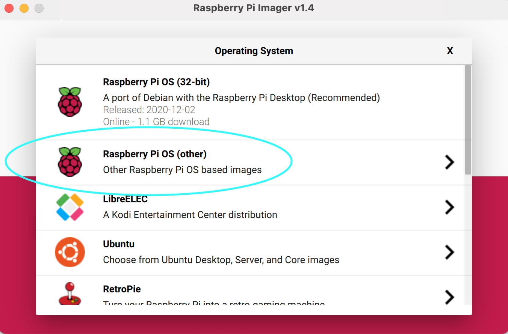
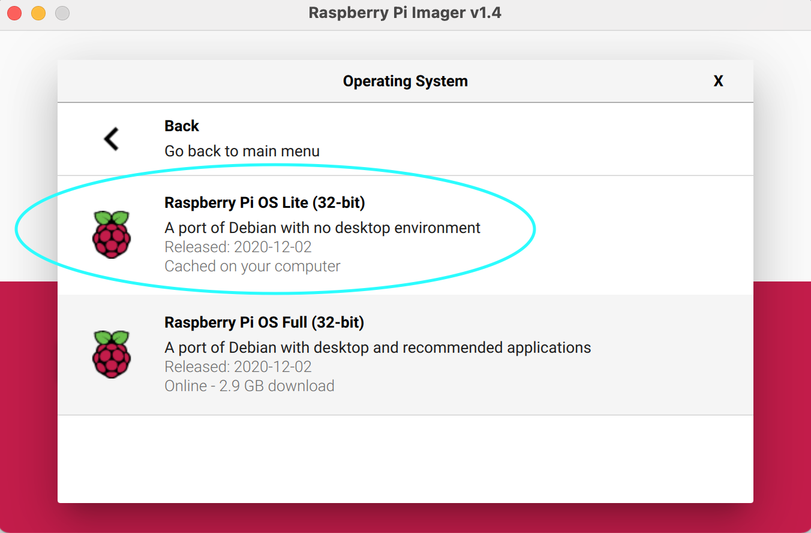

# Installing Raspberry Pi OS on your SD card

Follow normal instructions on https://www.raspberrypi.org/software/ 

I typically instal the no GUI version, but if you or your users want a GUI they can VNC into, then the GUI version works - although there might be more memory use and if any saving to SD card happens this tend to slow down response speed AND it might take more current from the 5v line.

REMEMBER: GUI uses more processing, therefore more current. I therefore strongly suggest no GUI versions. (But see https://raspi.tv/2017/how-much-power-does-pi-zero-w-use )

If you are using the Rapberry Pi Imager, these are the options to select:

