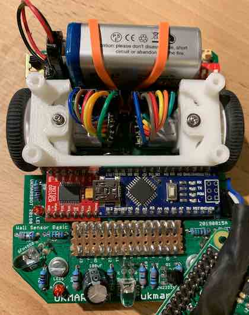
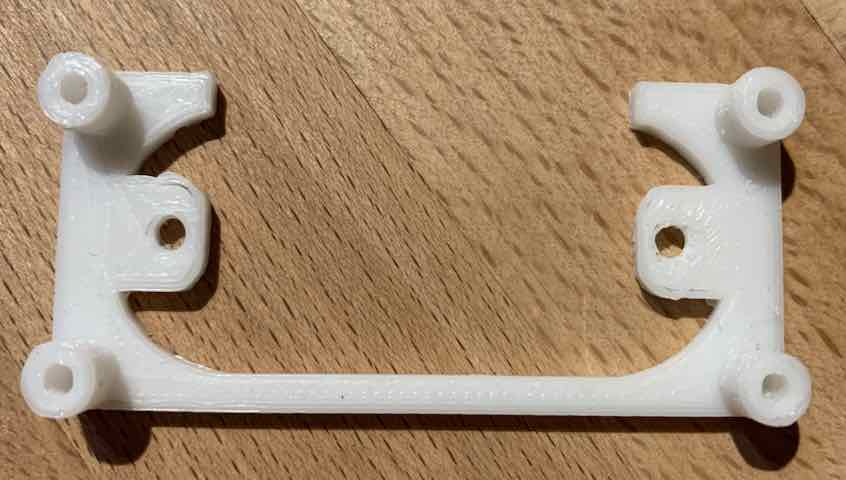
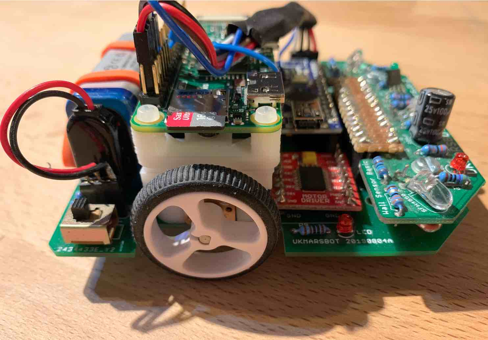
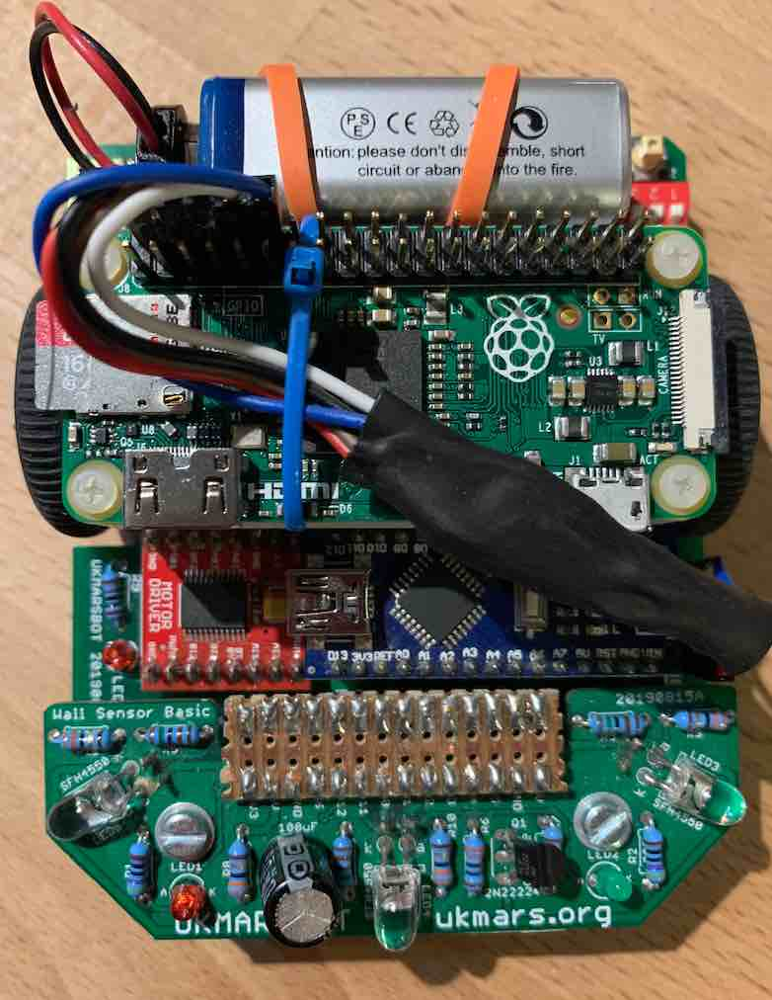
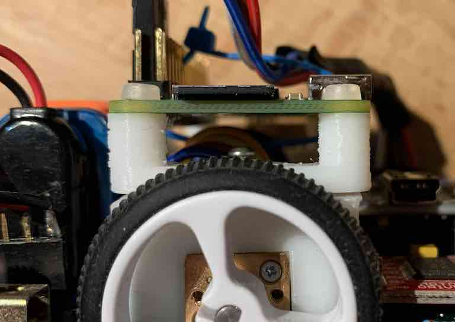
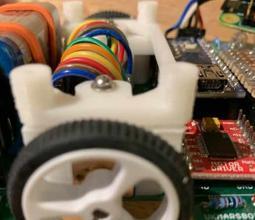
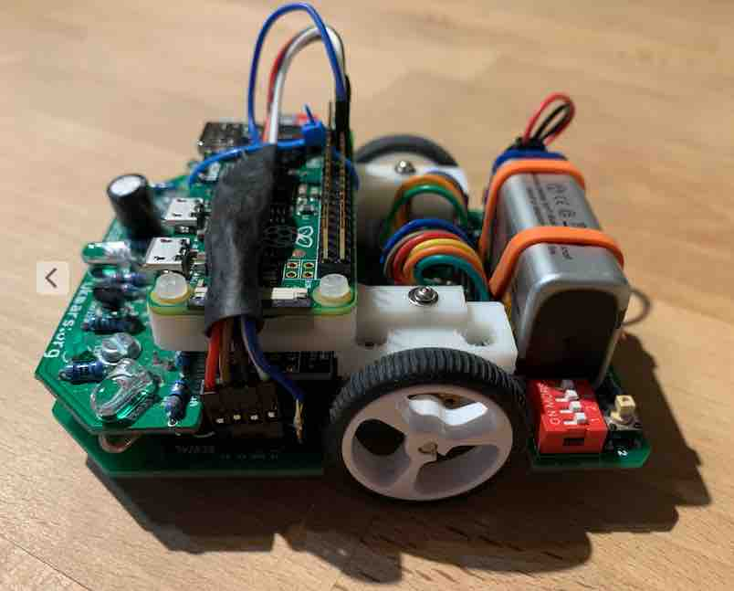
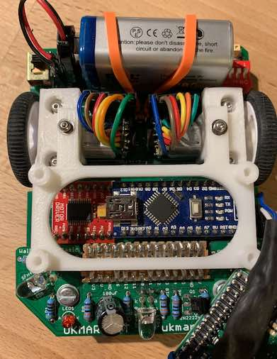
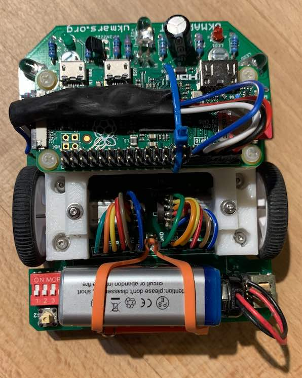

# Mechanical Mounting - Mounting the Raspberry Pi Zero onto UKMarsBot

To mount the Raspberry Pi securely requires some 3d Printing work.

The design here uses two parts - new motor mounts and the Pi Zero holder which is attached to the motor mounts. These are generated by OpenSCAD using the file ***'rpi_ukmarsbot_mount.scad'***

There are two options provided here (see photos below):
 - A front mount - over the Arduino. This keeps the motors clear, but increases the weight at the front of the Robot - which often is heavy already with sensors. The mini USB connector of the Arduino is still accessible, but the Arduino reset is covered.
 - A mid mount - over the Motors. This means that the weight is more equally distributed over the wheels and this doesn't increase the front weight as much. Any access to the motors or encoders involves removing the Pi Zero.

It might be possible to do a rear mounted, over the battery - but that isn't provided here. 

If you are re-generating the STL files from the OpenSCAD file (say after making a change), the control is generated by the following three settings towards the bottom of the file:
```
SELECT_PI_PLATE_FRONT = false;
MOTOR_MOUNTS = false;
SELECT_PI_PLATE_MID = true;
```
You can also see the whole assembly by selecting the motor mount and one of the two plates.

These are pre-generated STL files:
 * pi_plate.stl (front mount)
 * motor_mounts_only.stl (motor mounts with extra height and holes to fix plates)
 * pi_plate_mid_placement.stl (mid mount)

For fixings, I used M2.5 nylon screws to fix the Pi Zero to 'Pi Plate', and M2 9mm metal screws to fix the Pi plate to the motor mounts. These were fitted screwing into the 3D printed PLA - basically holding by friction fit - it might require some tuning for your specific application. For instance you might need to reduce the holes slightly, or use self-tapping screws.

# Pictures for the Mid Raspberry Pi Mount










# Pictures for the Front Raspberry Pi Mount







