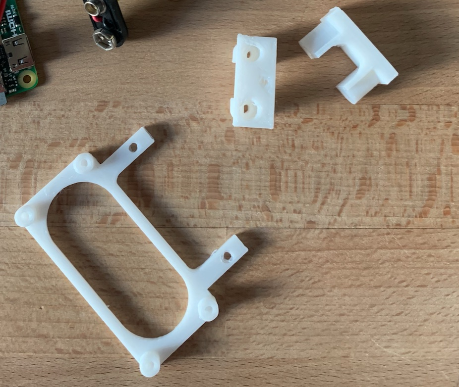
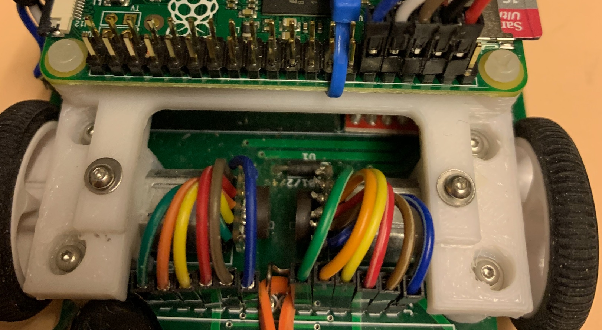
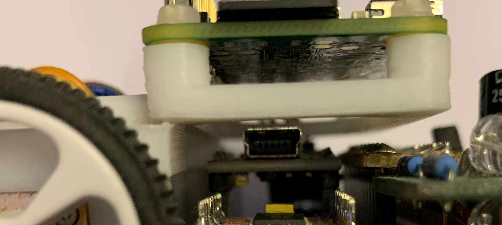

# Mechanical Mounting - Mounting the Raspberry Pi Zero onto UKMarsBot

To mount the Raspberry Pi securely requires some 3d Printing work.

The design here uses two parts - new motor mounts and the Pi Zero holder which is attached to the motor mounts. These are generated by OpenSCAD using the file ***'rpi_ukmarsbot_mount.scad'***

The control is generated by the following two settings towards the botton the file:
```
    SELECT_COMPLETE_PI_PLATE = true;
    MOTOR_MOUNTS_ONLY = false;
```
Yuo can also see the whole assembly by selecting:
```
    SELECT_FULL_ASSEMBLY = false;
```

These are pre-generate STL files:
 * pi_plate.stl
 * motor_mounts_only.stl

For fixings, I used M2.5 nilon to fix the Pi Zero to 'Pi Plate', and M2 9mm metal screws to fix the Pi plate to the motor mounts. These were fitted screwing into the 3D printed PLA - basically holding by friction fit - it might require some tuning for your specific application.







