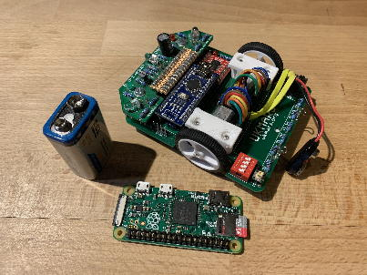
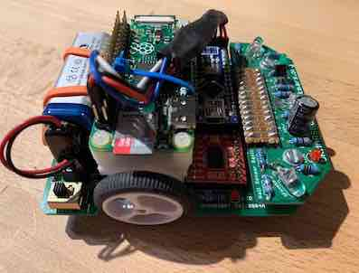

# Pizero for ukmarsbot
Adding a Rapberry Pi Zero onto the UK Mars Bot

]

# Background
The UKMarsBot is a maze solver and line follower, designed by the UK Mars and Robotics Society (UKMars). It has a Arduino Nano attached as the standard microcontroller. 

 - GitHub Project page: https://github.com/ukmars/ukmarsbot
 - UKMars Project page: https://ukmars.org/projects/ukmarsbot/
 - Building instructions for the UKMarsBot https://github.com/ukmars/ukmarsbot/wiki

This project aims to add a Raspberry Pi Zero to that basic design.

# Methods

There are two potential methods of connecting a Raspberry Pi Zero to the UKMARSbot:

1. Produce an adapter board that converts the Pi Zero header to the Arduino Nano footprint, completely replacing the Ardunio Nano. 
2. Connect the Raspberry Pi to the Arduino over a serial interface to the existing Arduino Nano and use the Nano as an I/O processor.

This article will examine the **second** option since this is the simpler option to construct, without a custom PCB. (There are, however, some notes on method 1 provided in '[Replacing the Arduino Nano Entirely](Documentation/Nano_Replacement.md)'.)

# Parts required 
  - UKMarsBot - tested working with Arduino Nano
  - Arduino Nano v3 (or equivalent third-party Nano)
  - Pi Zero v1.3

We will be using a Pi Zero (not a Pi Zero W which uses more power).

# Table of Contents
 - [Powering the Pi Zero … 5v Power … consideration on power](Documentation/Power_Requirements_Detail.md)
 - [What are the options for communicating between Pi Zero and Arduino Nano?](Documentation/Connections_Options.md)
 - [Summary of Electrical Connections between Pi Zero and Arduino Nano](Documentation/Connections_UART_Detail.md)
 - [Installing the Pi Zero Operating System](Documentation/Install_PiZero_OS.md)
 - [Logging into the PI](Documentation/Logging_into_Pi.md)
 - [Disable Linux Console on UART](Documentation/Disable_Linux_Console_on_UART.md)
 - [Scripting language for the I/O processor](Documentation/Pi_and_Nano_Software.md)
 - [Mechanical Mounting - Mounting the Pi Zero onto UKMarsBot](Documentation/Mechanical.md)
 - [Software for the Pi Zero](Documentation/Pi_Zero_Software.md)
 - [Shutdown down the Pi Zero](Documentation/Shutdown_Pi_Automatically.md)

# Advanced Topics (Not finished)
 - [Using a Pi Zero W instead of a Pi Zero](Documentation/Pi_Zero_W.md)
 - [Programming the Nano from the Pi Zero](Documentation/Programming_the_Nano.md)
 - [Speed up the Raspberry Pi Boot](Documentation/Speed_up_Pi_Boot.md)
 - [Real time processing on the Raspberry Pi](Documentation/Pi_Real-Time.md)
 - [Reducing Pi Zero Power consumption](Documentation/Reducing_Power_Consumption.md)
 - [Replacing the Arduino Nano Entirely](Documentation/Nano_Replacement.md)
 - [Crazy and Wierd ideas](Documentation/Other_Crazy_Ideas.md)

